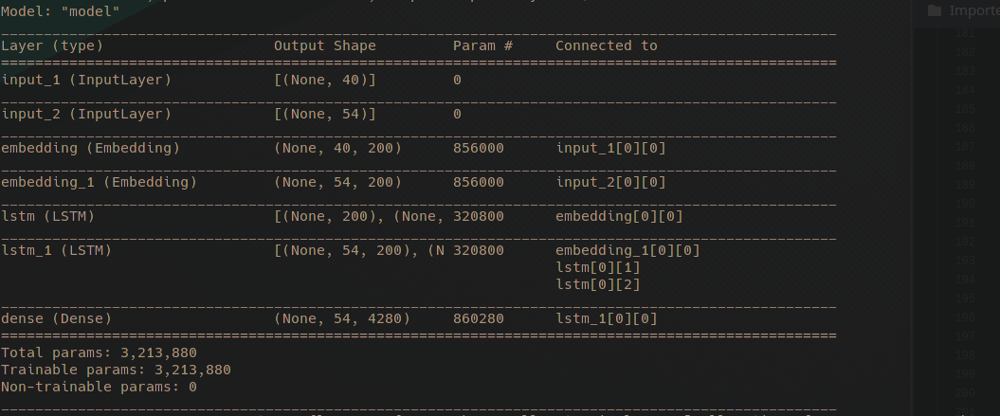
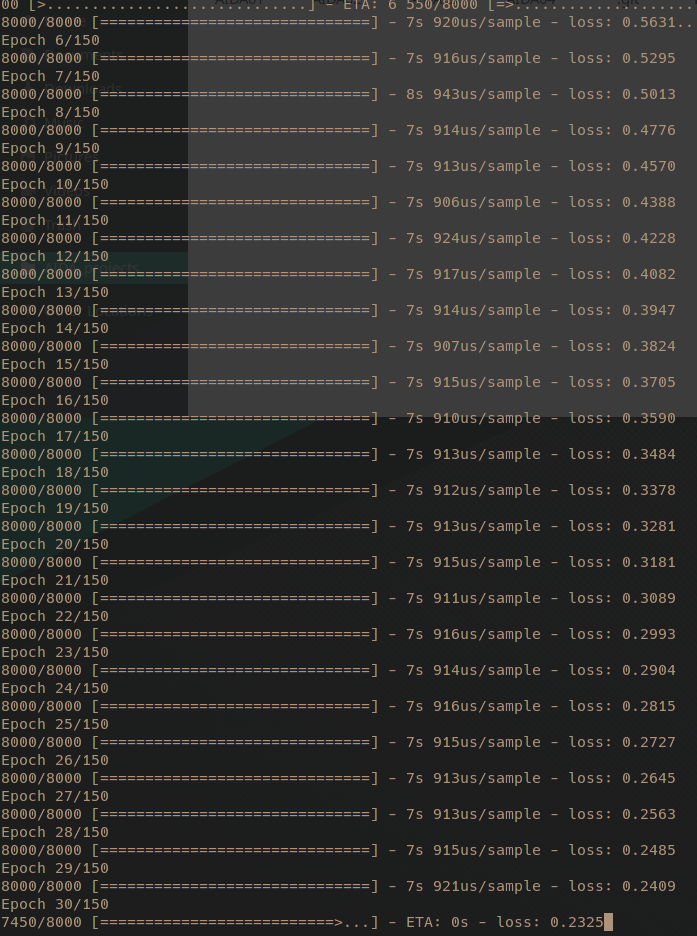

# ML & NLP Weeks 11-13
MSc Artificial Intelligence and Data Analytics, UOM

 *Create chatbot with Tensorflow using metalWOz dataset*

## Intro

 In this project I created a RNN base sequence to sequence model (enocder-decoder) in order to create a chatbot app, trained on metalWOz dataset which contains a bunch of different topics with questions and answers samples from possible user to a bot. The data turn to be quite big since it contains 238051 pairs of question-answer. In this proof of concept I used only first 8000 pairs in order to fit in memory!

## Initial Step
Reading data from metalWOz is a little problematic because the file is .txt format but inside looks like a .json but is not. So, I read the file as .txt line by line where each line treated like a json object. After read all data, I created a list of dictionaries objects, then the useful information of dictionaries was only the key's 'turns' values. The *key* **['turns']** has all the questions and answers sentences, which was pushed list in a all together (as they are inside dictionary). Then I have to split them in questions and answers by defining which was talking, for that I supposed that user start the conversation with a random *greeting* [e.g. 'Hi'] and closes with a random *closing* [e.g. 'Thanks','bye'], check ***read_metalWOzQA()*** function lines *57-97*. With this technic I managed to evenly split sentences in the two categories (questions and answers). At the end I saved them into pairs in a *.tsv* file format inorder to use them directly with *pandas* library and not repeat the whole process from start each time.

## Prepare Data for the model

In this step after loading questions and answers data, I added some start and end tokens to each answer and I concatanated into ***question** followed by an **answer with tags***. Then I created the vocabulary by using the *Tokenizer* package of Tensorflow.

The next step was to format the input for encoder, decoder and the output by using the *text_to_sequences* and *pad_sequences* functions. This process assigns a value to each word inorder to pass the to embendings layer ( word represented by a number ). The output was also one-hot-encoded at the end.

## Model Architecture

The model has two modules the Encoder and the Decoder. The Encoder has an input layer where the questions are feed, then there is an embending layer followed by an **LSTM** module.

As for the Decoder it has also the same layers as the encoder but furthermore it has one layer where the states of encoder are bypassing the pipeline and inserting the layer (more like a Residual architecture) and then finally there is a *Dense*    layer  using *softmax* as activation function in order to define the probability of each output word to be in output sequence as answer.

-> Model Parameters:

## Training Phase

Synthesize model with stacked encoder and decoder using *Adam* optimizer and *categorical cross entropy* as loss function. The model trained only in a small part of data only 8000 (~1/20 of the whole dataset) with a batch_size=50, for 250 epochs. Inorder to feed the network with all dataset I have to load data in chunks and it would take much more time so I only use one small chunk.

-> Training Execution image:

## Chating

### Usefull Links:

[Model inspirated](https://medium.com/predict/creating-a-chatbot-from-scratch-using-keras-and-tensorflow-59e8fc76be79)

[Reading data Idea](https://github.com/eloukas/seq2seq-chatbot/blob/master/pytorch_seq2seq_chatbot.ipynb)

-----------------------
Tassos Karageorgiadis

|January 2021|
