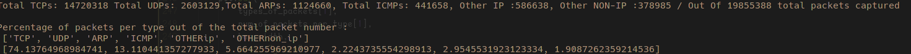
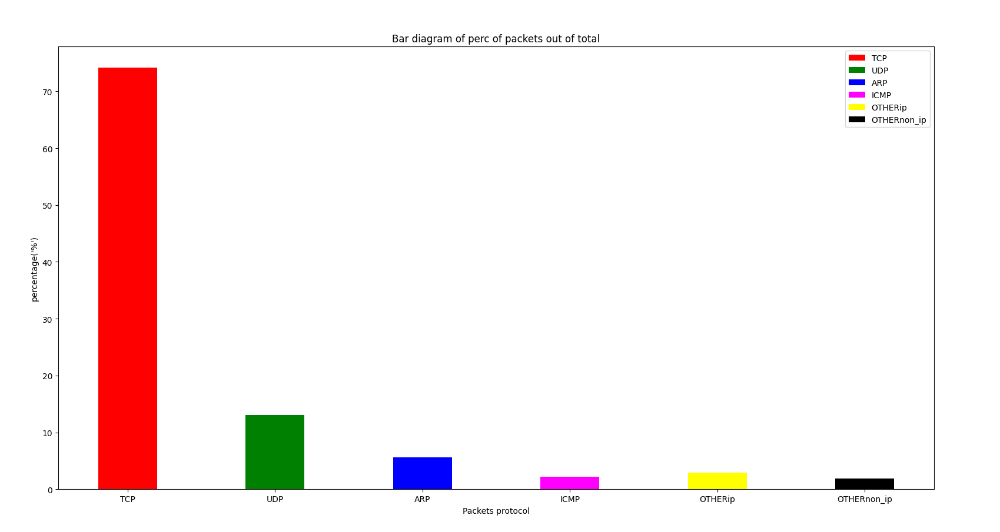
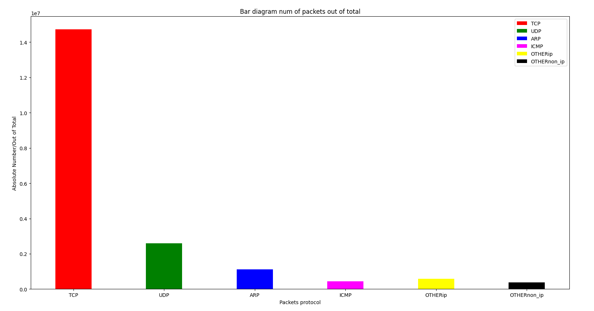
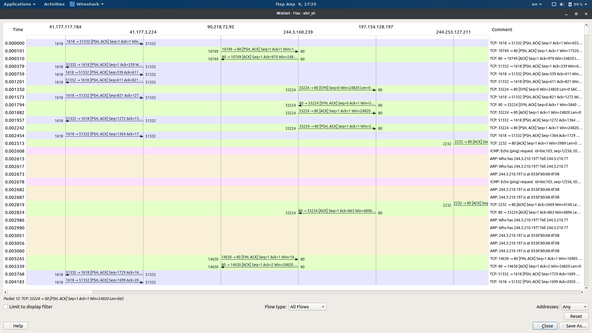

# Data Centers Traffic Analysis

### HW2 Big Data Networks

### AID21002
------------------------------------------------------

### A) Introduction:

-----------------
In this project I had to read a set of *.pcap* files and create a program that analyzes traffic statistics per protocol type or per flow for each protocol. The types of protocols that were taken into account was *TCP, UDP, ARP, ICMP*. All other types just ignored or simple count them as a percentage of the total traffic of packets across all data. The program was developed using Python while familiarized with the format of data per packet using Wireshark.

### B) Count packets per protocol:
------------------------------
In order to count the number of packets per protocol I keep a counter for each type of protocols increasing each time with find a specific protocol packet inside a pcap file's buffer. The types that I keep is referenced inside a list **types_of_packets = ["TCP", "UDP", "ARP", "ICMP", "OTHERip", "OTHERnon_ip"]**, where *OTHERip* is all other protocols that have IPs except TCP, or UDP or ICMP and *OTHERnon_ip* is all the protocols except ARP, which are to using IPs. As a result I got the following stats about the number of packets per protocols :

Then I represent the above information with two figures showing the percentage and the raw number of packets per protocol type.

<ins>**Percentage Bar Plot**</ins>

<ins>   **Raw value Bar Plot**</ins>

### C) CDF flow analysis per protocol:
----------------------------------

In order to group packets into flows I used a python dictionary where key field contains a tuple with *sourceIP,sourcePort, destinationIP,destinationPort, and protocol_type*. In our case we take into account only TCP or UDP protocol flows so the the *protocol_type* field inside key's tuple has one string value "TCP" or "UDP". About the value part of the dictionary this is a list type and contains values like size,duration and last_timestamp. For example, a record inside our dictionary is ***('147.23.2.1', 80, '147.23.6.10', 456, 'TCP'):[60, 2, 1261070358.462197]***,so inside values' list size is the total size of a flow, duration value is the total duration of flow,timestamp is the last packet's  timestamp (last packet of a flow).

About the results, I got a total number of *TCP flows* equal to **23695** while *UDP flows* were counted **33655**. It would be important to notice that at the end I used two different dictionaries one TCP flows and one for UDP.

As for computing the CDF for each type of flows I've create 2 lists for TCP flows keepin in one list the sizes of each flow, and into the other the duration for each flow. The same approach was used for UDP flows also. Then I used *numpy* library's histogram function to create bins, and number of elements (counts) aka a distribution, after that I computed the PDF values as *counts/sum(counts)*  and then computed the CDF using the *numpy.cumsum()* function. This process repeated four times one for *tcp flows' size*, one for *tcp flows' duration*, an other one for *udp flows' size* and finally one for *udp flows' duration*. This is part of the code starting at line *336* till line *377*. At the end I print the results using matplotlib. 

### D) Extra Figures :

In the next figure we see the flows for *'univ1_pt1'*.pcap file analyzed inside the *Wireshark* environment using wireshark statistics and flows. This figures show the flows from IP to IP showing details about source and destination ports while at the comment section we can see the extra info for each flow e.g. protocol,ACK,SYN signals, etc.

### References:
-----------------

1. | [CDF Packets sizes examples][1]

2. | [ARP packet sizes ][2]

3. | [Flow-based TCP Connection Analysis][3]

4. | [ICMP packets][4]

5. | [ARP packets][5]

6. | [TCP packet][6]

7. | [Wireshark packets filtering][7]

8. | [TCP Timestamps][8]

[1]:https://www.researchgate.net/figure/Packet-size-CDF-per-protocol-in-downlink-left-and-uplink-right-traffic_fig2_228395666
[2]:https://community.cisco.com/t5/switching/arp-packet-size/td-p/1551467
[3]:https://www2.tkn.tu-berlin.de/bib/limmer2009flowbased/limmer2009flowbased.pdf
[4]:https://en.wikipedia.org/wiki/Internet_Control_Message_Protocol
[5]:https://en.wikipedia.org/wiki/Address_Resolution_Protocol
[6]:https://el.wikipedia.org/wiki/%CE%A0%CF%81%CF%89%CF%84%CF%8C%CE%BA%CE%BF%CE%BB%CE%BB%CE%BF_%CE%95%CE%BB%CE%AD%CE%B3%CF%87%CE%BF%CF%85_%CE%9C%CE%B5%CF%84%CE%B1%CF%86%CE%BF%CF%81%CE%AC%CF%82
[7]:https://linoxide.com/wireshark-filters/
[8]:https://cloudshark.io/articles/tcp-timestamp-option/

### Author

Tassos Karageorgiadis April,2021
