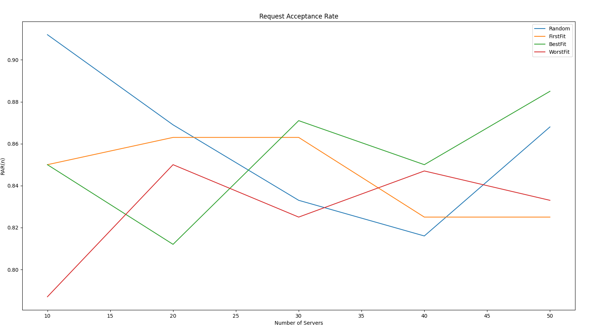
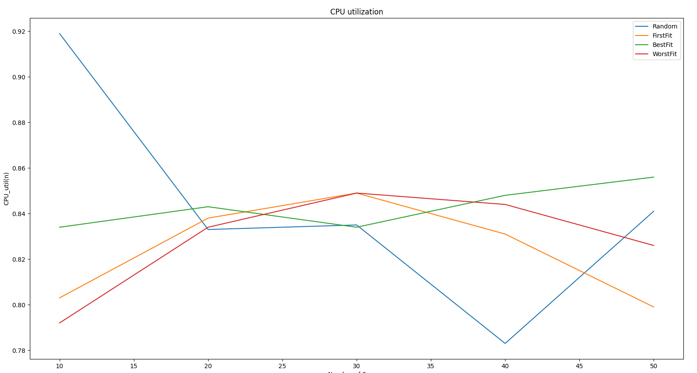
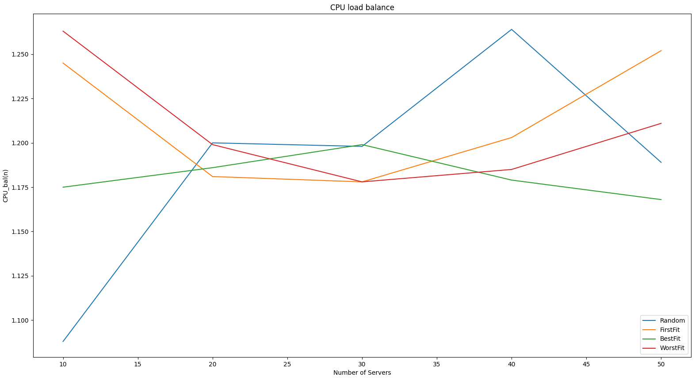
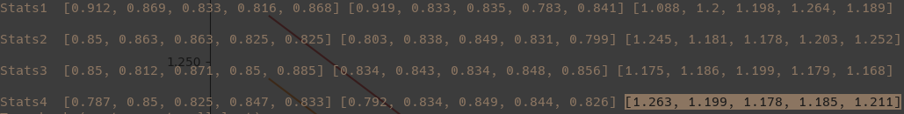

# HW 3 Big Data Networks
## Tassos Karageorgiadis aid21002

### Introduction :
In this project/assignment I had to create a **Mininet** topology with *N  ={10,20,30,40,50}* servers hosts and one embedder host, create some uniform distributed requests for cpu allocation. Furthermore, the embedder was running methods for selecting the appropriate server, these methods were a) random, b)first-fit, c)best-fit, d)worst-fit. Each method returns an index to server and then the embedder creates a *xmlrpc* request to the server selected to ask if it can accept the request for cpu allocation. Finally, 3 methods for metrics was used a) request-acceptance-rate, b) cpu-utilization (average across all servers) and c) cpu-load-balancing.

### Problem Design Summary:
As for the actual implementation  a script named ***topo_bench.py*** was created where a topology is created *(class Topology)* in a for loop for each N ={10,20,30,40,50} before creating a new topology I cleaned the previous one by executing ***sudo mn -c*** command using a subprocess module. Then I have a *for loop* of size **N(i)\*8** ***requests***, for each server selection method *{random,first-fit,best-fit,worst-fit}*. For each request a **tserver.py** script is executed in the selected server instance by using the **host.popen("python3 ..")** method of the *Mininet API*, then I added a time delay in order to give the appropriate time to server to start, and then I was executing the **tclient.py** script from the embedder host using the ***host.cmdPrint("python3 tclient.py IP current_cpu_load new_cpu_req")***. Then I recorded the response where an boolean value was return for the acceptance or not of the request and a new cpu load value for selected server. Finally there is a ***class GraphPlots*** which is used by creating an instance and calling the needed plot functions in order to show the benchmark results per server's selection method. There are three plots --one per metric function-- where in each plot there are four lines representing each server's selection method that is used from the embedder.


----------------------------

### Results :


#### Plot for Request Acceptance Rate per server selection method



As we see from the above plot ***BestFit*** server's selection method outperforms in term of *Requests Acceptance Rate* while the number of available host-servers increasing. In addition we see that **Random** method performs very well for a small N value and then drops but for a *N>40* seems the second best choice.

#### Plot for CPU utilization per server selection method



Again in this plot we see that ***BestFit*** method performs very well in terms of CPU utilization while the number of host-servers increasing. But for a value of N~30 we see that the best performance is given ***FirstFit*** and ***WorstFit***.

#### Plot for CPU balancing per server selection method



--------------------------------------------------------------------------------
#### Raw OutPut of Programm :



Where row ***Stats_i*** stands for server's selection method i for example *Stats1* is the statistics for running **Random** server's selection method for each N, number of servers-hosts. While there are three columns, showing the metrics method standing for *{RAR,CPU_utilization,CPU_balancing}* respectively. More precisely *row 1*, *column 1* aka *(Stats1,RAR)* representing a list with five values each value corresponding to a specific *N {10,20,30,40,50}*.

---------------------------------------------

## Code Appendix For experiments methods:


### Selection Methods Code :
```
def random_server_indx(self):
    return random.randrange(len(self.servers_avail_load))

def first_fit_server_indx(self, cpu_req):
    return next(
        (indx for indx, x in enumerate(self.servers_avail_load) if x >= cpu_req)
    )

def best_fit_server_indx(self, cpu_req):
    min_val = min(val for val in self.servers_avail_load if val >= cpu_req)
    return self.servers_avail_load.index(min_val)

def worst_fit_server_idx(self):
    max_val = max(self.servers_avail_load)
    return self.servers_avail_load.index(max_val)

```


### Metrics Functions Code:
```

def request_acceptance_rate(self):
    return round(self.accepted_req / self.NumOfRequests, 3)

def cpu_utilization(self):
    self.cpu_avg_util = round(sum(self.cpu_perc_used) / len(self.cpu_perc_used), 3)
    return self.cpu_avg_util

def cpu_balancing(self):
    max_val = max(self.cpu_perc_used)
    return round(max_val / self.cpu_avg_util, 3)

```
